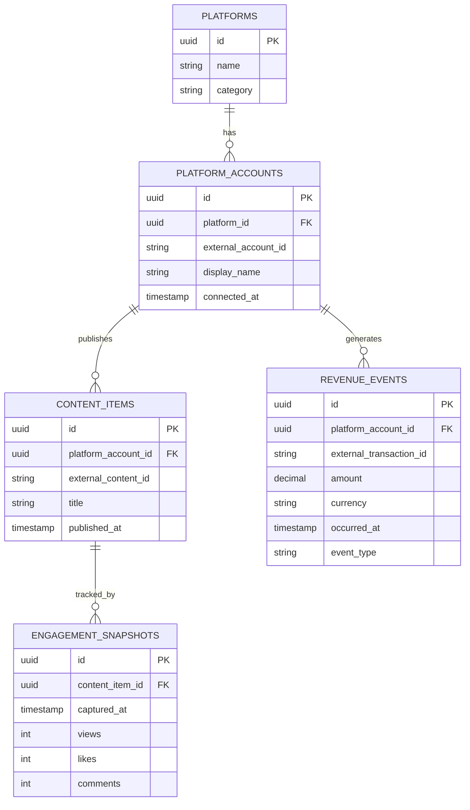

# Creator Analytics Dashboard — ERD

Core question this schema answers: **which platform drives the most engagement relative to revenue?**

## Design notes

A platform account -->

- `PLATFORM_ACCOUNTS` sits between `PLATFORMS` and everything else, so a single platform (e.g. YouTube) can have multiple connected accounts later if needed.
- `ENGAGEMENT_SNAPSHOTS` stores a new row every time stats are re-pulled for a content item, this preserves history so metrics can be computed over any time window (last 30 days, last quarter, etc.) at query time, rather than baking a fixed window into the schema.
- `REVENUE_EVENTS` is naturally event-shaped, so no snapshotting is needed there.
- Time-window filtering (e.g. "last 30 days") is applied in queries against `captured_at` / `occurred_at`

## Diagram

## Current platforms

- YouTube
- Twitch
- Shopify
- Patreon

Later additions:
- Kick
- Gumroad
