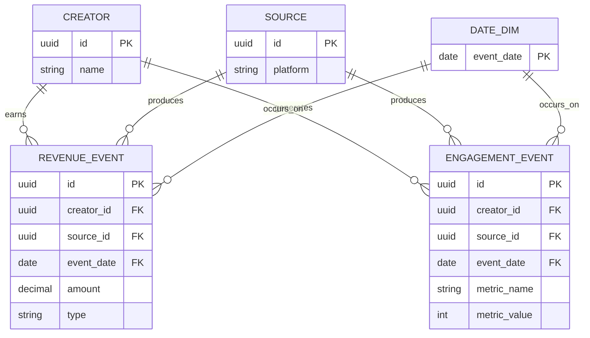

# Data model

The unified marts layer, expressed as an ER diagram (view with any
mermaid-compatible renderer, e.g. GitHub or the mermaid live editor).

## Why two fact tables instead of one

A YouTube view and a Shopify sale don't share attributes -- forcing them
into one giant table means lots of null columns and awkward filtering.
Two fact tables (`revenue_event`, `engagement_event`) keep each shape
clean, while `source` on both makes it possible to trace any row back to
the platform it came from, and to add a new source later without
changing the shape of existing ones.
